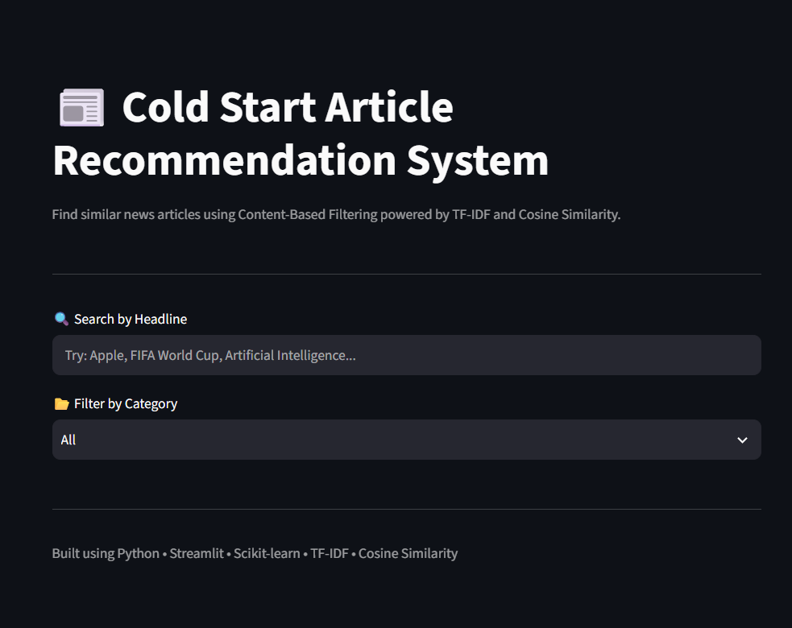
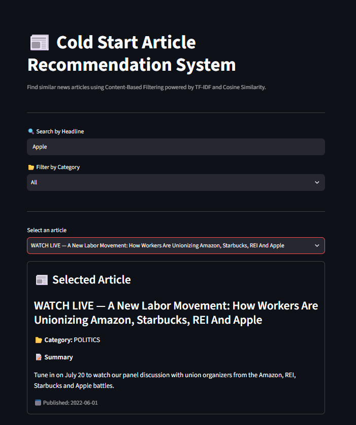
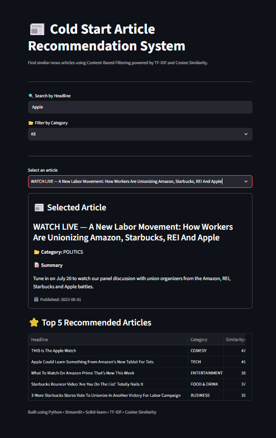

# 📰 Cold Start Article Recommendation System

A **content-based news article recommendation system** designed to address the **item cold-start problem** using **TF-IDF vectorization and Cosine Similarity**.

The system analyzes article content and recommends similar news articles without requiring user ratings, browsing history, likes, or previous interactions.


🚀 **Live Demo:**  
https://cold-start-article-recommender.streamlit.app/

---

## 📌 Project Overview

Recommendation systems commonly depend on historical user interactions to understand user preferences. This creates a major challenge when a **new article has no interaction history**.

This project addresses the **item cold-start problem** using a content-based approach.

Instead of relying on user behavior, the system analyzes:

- Article headlines
- Article descriptions
- Article categories

The content is transformed into numerical representations using **TF-IDF**, and **Cosine Similarity** is used to identify the most similar articles.

### Core Pipeline

```text
HuffPost News Dataset
        ↓
Data Cleaning
        ↓
Text Preprocessing
        ↓
Headline + Description
        ↓
TF-IDF Vectorization
        ↓
TF-IDF Matrix
        ↓
User Selects Article
        ↓
Cosine Similarity
        ↓
Top 5 Similar Articles
        ↓
Similarity Score + Shared Keywords
        ↓
Streamlit Web Application
```

---

# 🎯 Problem Statement

Traditional recommendation systems often depend on user-item interaction data.

For a newly published article:

```text
New Article
    ↓
No clicks
No ratings
No likes
No reading history
    ↓
Collaborative filtering struggles
```

This is known as the **item cold-start problem**.

### Proposed Solution

Use the article's own content:

```text
New Article
    ↓
Headline + Description
    ↓
Text Processing
    ↓
TF-IDF
    ↓
Content Representation
    ↓
Similarity Search
    ↓
Relevant Articles
```

This allows recommendations to be generated without requiring historical user interactions.

---

# 🧠 Machine Learning Approach

## Content-Based Filtering

The system uses **content-based filtering**.

Articles are recommended based on the similarity of their textual content.

---

# 🔢 TF-IDF

TF-IDF stands for **Term Frequency–Inverse Document Frequency**.

It assigns importance to words based on:

- How frequently a word occurs in an article.
- How uncommon the word is across the complete collection of articles.

The project uses `TfidfVectorizer` from Scikit-learn.

---

# 📐 Cosine Similarity

After converting articles into TF-IDF vectors, the system calculates their similarity using **Cosine Similarity**.

```text
Article A → TF-IDF Vector
Article B → TF-IDF Vector
             ↓
      Cosine Similarity
             ↓
      Similarity Score
```

A higher score indicates that the articles have more similar textual representations.

The system then selects the **Top 5 most similar articles**.

---

# 🧹 Data Preprocessing

The text preprocessing pipeline includes:

```text
Raw Text
   ↓
Lowercasing
   ↓
HTML Removal
   ↓
URL Removal
   ↓
Punctuation Removal
   ↓
Number Removal
   ↓
Tokenization
   ↓
Stopword Removal
   ↓
Lemmatization
   ↓
Clean Text
```

The headline and short description are combined to create a richer text representation.

```python
text = headline + short_description
```

Missing text values are also handled before model training.

---

# 📊 Dataset

The project uses the **HuffPost News Category Dataset**.

Approximately:

**209,527 news articles**

The dataset contains:

- `headline`
- `short_description`
- `category`
- `authors`
- `date`

The main textual representation is constructed using:

```text
headline + short_description
```

---

# 🔍 Application Features

## 1. Article Search

Users can search for articles using headline keywords.

Examples:

```text
Apple
Climate
Trump
Technology
```

## 2. Category Filtering

Users can narrow search results by news category.

## 3. Article Selection

The application displays:

- Headline
- Category
- Summary
- Publication date

## 4. Top 5 Recommendations

The system generates the five most similar articles using Cosine Similarity.

## 5. Similarity Score

Each recommendation includes a similarity percentage.

## 6. Recommendation Explanation

The application identifies shared high-weight keywords between the selected article and recommended articles.

This provides a simple explanation of:

> **Why was this article recommended?**

---

# 🖥️ Application Screenshots

## Home Page



## Article Search



## Recommendations



---

# 🏗️ Project Architecture

```text
                         ┌──────────────────────┐
                         │    HuffPost Dataset  │
                         └──────────┬───────────┘
                                    │
                                    ▼
                         ┌──────────────────────┐
                         │  Data Preprocessing  │
                         └──────────┬───────────┘
                                    │
                                    ▼
                         ┌──────────────────────┐
                         │   TF-IDF Vectorizer  │
                         └──────────┬───────────┘
                                    │
                                    ▼
                         ┌──────────────────────┐
                         │    TF-IDF Matrix     │
                         └──────────┬───────────┘
                                    │
                                    ▼
┌───────────────┐         ┌──────────────────────┐
│     User      │────────▶│   Streamlit App      │
└───────────────┘         └──────────┬───────────┘
                                     │
                                     ▼
                           ┌─────────────────────┐
                           │ Cosine Similarity   │
                           └─────────┬───────────┘
                                     │
                                     ▼
                           ┌─────────────────────┐
                           │ Top 5 Recommendations│
                           └─────────────────────┘
```

---

# 📁 Project Structure

```text
cold-start-article-recommender/
│
├── app/
│   └── app.py
│
├── src/
│   ├── __init__.py
│   ├── preprocessing.py
│   ├── feature_engineering.py
│   ├── recommender.py
│   ├── train_model.py
│   └── utils.py
│
├── notebooks/
│   └── 01_eda.ipynb
│
├── screenshots/
│   ├── home.png
│   ├── search.png
│   └── recommendations.png
│
├── models/
│   └── README.md
│
├── README.md
├── requirements.txt
└── .gitignore
```

---

# ⚙️ Technologies Used

| Technology                | Purpose                      |
| ------------------------- | ---------------------------- |
| Python                    | Core programming language    |
| Pandas                    | Data processing              |
| NumPy                     | Numerical operations         |
| NLTK                      | Text preprocessing           |
| Scikit-learn              | TF-IDF and Cosine Similarity |
| Joblib                    | Model/artifact serialization |
| Streamlit                 | Web application              |
| Hugging Face Hub          | ML artifact storage          |
| Git                       | Version control              |
| GitHub                    | Source code hosting          |
| Streamlit Community Cloud | Deployment                   |

---

# 🚀 Running the Project Locally

## 1. Clone the repository

```bash
git clone https://github.com/snehitha-araveti/cold-start-article-recommender.git
cd cold-start-article-recommender
```

## 2. Create a virtual environment

```bash
python -m venv venv
```

### Windows

```bash
venv\Scripts\activate
```

## 3. Install dependencies

```bash
pip install -r requirements.txt
```

## 4. Run the Streamlit application

```bash
streamlit run app/app.py
```

The application will open in your browser.

---

# ☁️ Deployment Architecture

Large ML artifacts are intentionally **not stored inside the GitHub repository**.

Instead, the project separates source code from large model artifacts.

```text
                 GitHub
                   │
                   ▼
             Streamlit Cloud
                   │
                   ▼
              app/app.py
                   │
                   │ hf_hub_download()
                   ▼
             Hugging Face
                   │
        ┌──────────┼──────────┐
        ▼          ▼          ▼
    Dataset    TF-IDF      Vectorizer
    Artifact    Matrix      Artifact
        │          │          │
        └──────────┼──────────┘
                   ▼
             Live Application
```

### Hugging Face Artifacts

The large serialized artifacts are hosted separately:

**Hugging Face Dataset:**  
https://huggingface.co/datasets/abcd922436/cold-start-article-recommender-artifacts

The application downloads the required artifacts when running.

This keeps the GitHub repository lightweight while allowing the deployed application to use the complete model artifacts.

---

# 🧠 Engineering Decisions

## Why Content-Based Filtering?

The project focuses on the **item cold-start problem**.

Content-based filtering does not require previous user-item interactions, making it suitable for recommending newly introduced articles based on their textual content.

## Why TF-IDF?

TF-IDF is:

- Lightweight
- Interpretable
- Efficient for textual data
- Easy to inspect
- A strong baseline for content-based recommendation

## Why Cosine Similarity?

Cosine Similarity works well for comparing high-dimensional text representations.

## Why not calculate the complete similarity matrix?

Calculating similarity between every pair of 209K+ articles would require a very large amount of memory.

Instead, the system calculates:

```text
One selected article
        ×
All available articles
```

This significantly reduces the memory requirement during recommendation requests.

---

# ⚠️ Limitations

### 1. Lexical similarity

TF-IDF primarily captures word-level importance and overlap. It does not understand language semantics as deeply as transformer-based embeddings.

For example:

```text
car
automobile
```

may not receive a high similarity purely because they have similar meanings.

### 2. No personalization

The current recommender does not use:

- User history
- Click behavior
- Ratings
- Likes
- Reading time
- Personal preferences

### 3. Headline-based search

The application's search functionality currently searches article headlines using keyword matching rather than semantic search.

### 4. No user-interaction ground truth

The dataset does not provide user click/rating data, so real user preference evaluation is outside the scope of the current implementation.

---

# 🔮 Future Improvements

## Semantic Embeddings

Replace or complement TF-IDF with transformer-based embeddings such as Sentence-BERT.

```text
TF-IDF
   ↓
Sentence-BERT Embeddings
   ↓
Semantic Similarity
   ↓
Improved Recommendations
```

## Efficient Vector Search

For larger-scale recommendation systems, approximate nearest-neighbor search using technologies such as FAISS or vector databases could improve retrieval efficiency.

## Hybrid Recommendation

A future version could combine:

```text
Content-Based Filtering
          +
User Interaction Data
          ↓
Hybrid Recommendation System
```

This could provide both cold-start capability and personalization.

---

# 📈 Current System

The current system provides:

- ✅ Content-based article recommendation
- ✅ Item cold-start handling
- ✅ 209K+ article dataset
- ✅ Text preprocessing pipeline
- ✅ TF-IDF feature representation
- ✅ Cosine Similarity recommendation
- ✅ Top-5 recommendations
- ✅ Similarity scores
- ✅ Shared keyword explanations
- ✅ Category filtering
- ✅ Article search
- ✅ Streamlit interface
- ✅ Cloud deployment
- ✅ Separate ML artifact hosting

---

# 🌐 Live Demo

Try the deployed application:

👉 **https://cold-start-article-recommender.streamlit.app/**

---

# 👩‍💻 Author

**Snehitha Araveti**

B.Tech Computer Science Engineering

---

# ⭐ Acknowledgement

This project was developed as part of the **IIT Jammu Data Science & AI Internship**.

The project focuses on applying practical machine learning, natural language processing, recommendation systems, software engineering, and deployment concepts to a real-world recommendation problem.
